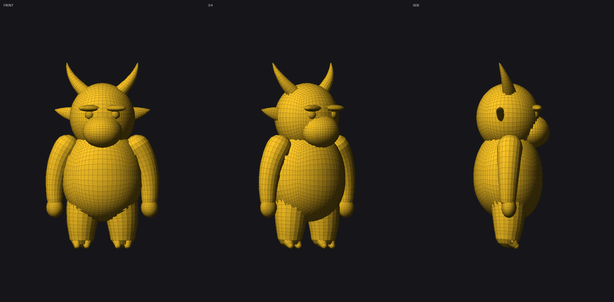
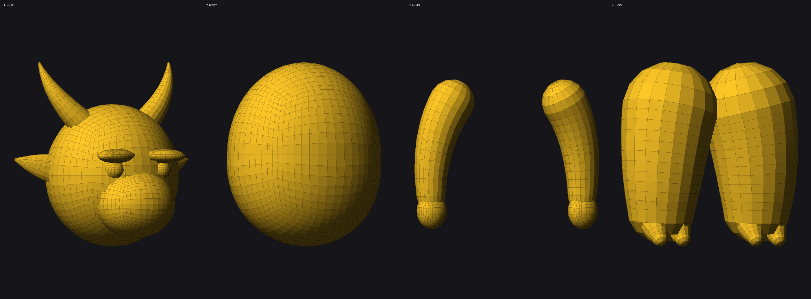

# Nomad Sculpt — Yellow Fur Bull-Character Kit

ชุด **Alpha/Stamp** (แผนที่ความสูงสีเทา) และ **คู่มือสัดส่วนร่างกาย** สำหรับปั้นตัวละครวัวขนสีเหลืองทรงกลมอ้วนป้อม (จากภาพอ้างอิง) ด้วยแอป **Nomad Sculpt** บน iPad/Android

> Nomad Sculpt ไม่มีระบบ "custom brush code" แบบเขียนโปรแกรม แต่ใช้ **Alpha/Stamp เป็นภาพ grayscale (.png)** ที่นำเข้าไปใช้กับแปรง Stamp / Drag Dot / Layer Brush ได้ ไฟล์ในโฟลเดอร์ `alphas/` ทั้งหมดออกแบบมาให้ใช้กับระบบนี้โดยตรง

## โครงสร้างไฟล์

```
nomad-sculpt-yellow-bull-kit/
├── models/                         โมเดล blockout (.obj) — import เข้า Nomad ได้เลย
│   ├── 00_full_blockout.obj        ทั้งตัวรวม 19 ชิ้น (แยก object ในไฟล์เดียว)
│   ├── 01_head.obj                 หัว: กะโหลก, ปาก, หู×2, เขา×2, คิ้ว×2, ตา×2
│   ├── 02_body.obj                 ลำตัวทรงถัง (พุงย้อยหน้า ผายล่าง)
│   ├── 03_arms.obj                 แขน×2 + มือ×2
│   └── 04_legs.obj                 ขา×2 + กีบผ่า×2 (ข้างละ 2 นิ้ว)
├── alphas/
│   ├── fur_strand_tileable.png     2048² ต่อลายไร้รอยต่อ ขนสั้นเป็นทิศทาง (ลำตัว/แขน/ขา)
│   ├── fur_clump_stamp.png         1024² สแตมป์ปอยขนพวยพุ่งจากจุดกลาง (ปั้มเป็นกระจุกๆ)
│   ├── skin_pores_tileable.png     2048² ต่อลายไร้รอยต่อ ผิวเป็นปุ่มละเอียด (จมูก/ปาก/มือ/เท้า)
│   ├── snout_wrinkle_stamp.png     1024² ริ้วรอยย่นวงรอบจมูก-ปาก
│   ├── horn_ridge_tileable.png     2048² ต่อลายไร้รอยต่อ ริ้วเคราตินตามยาวเขา
│   ├── hoof_ridge_stamp.png        1024² วงแหวนการเติบโตปลายเขา/กีบ/เล็บ
│   ├── ear_inner_fold_stamp.png    1024² รอยพับซ้อนในใบหู
│   └── eyelid_crease_stamp.png     1024² รอยย่นเปลือกตา/คิ้ว
└── reference/
    ├── body_proportions_guide.png  ไกด์สัดส่วนร่างกาย + จุดสังเกตทางกายวิภาค
    ├── blockout_views.png          ภาพโมเดล blockout มุมหน้า / 3-4 / ข้าง
    └── blockout_parts.png          ภาพแยกทีละส่วน (หัว / ลำตัว / แขน / ขา)
```

## โมเดลโครงสร้างร่างกาย (blockout)





โมเดลใน `models/` เป็น **base mesh สำหรับปั้นต่อ** ไม่ใช่งานจบ — ปั้นเป็นทรงหลักไว้ให้แล้ว
คุณเอาไป **Subdivide แล้วปั้นรายละเอียด + ปั้มขน** ต่อได้ทันที

**คุณสมบัติของ mesh**
- โครงสร้างเป็น **quad เกือบทั้งหมด** (หัวใช้ cube-sphere ไม่มีจุดรวมขั้ว pole) → Subdivide แล้วไม่บิดเบี้ยว เหมาะกับการปั้นมาก
- ทุกชิ้นเป็น **object แยก** ใน Nomad → เลือกปั้นทีละส่วนได้ ซ่อน/แสดงได้อิสระ
- พิกัดตรงกันทุกไฟล์ (world position เดียวกัน) → import แยกทีละไฟล์ ชิ้นส่วนจะมาประกอบกันพอดี ไม่ต้องขยับเอง
- แกน: **+X = ขวาของตัวละคร, +Y = ขึ้น, +Z = ด้านหน้า** ยืนบนพื้น Y=0 สูงประมาณ 100 หน่วย
- ~9,700 faces ทั้งตัว (เบา ลื่นบน iPad, เหลือ budget ให้ subdivide อีกหลายชั้น)

### วิธี import โมเดลเข้า Nomad Sculpt

1. โหลดไฟล์ `.obj` ที่ต้องการลงเครื่อง
2. เปิด Nomad Sculpt → เมนู **Files** → **Import**
3. เลือกไฟล์ `.obj` → ชิ้นส่วนจะเข้ามาเป็นหลาย object ในหน้าต่าง **Scene**
4. เริ่มปั้นตามลำดับ 1→4 ด้านล่าง (เลือก object ที่จะปั้นจากหน้าต่าง Scene ก่อนเสมอ)

### ลำดับการปั้นทีละส่วน

**1. ส่วนหัว** (`01_head.obj`) — 10 ชิ้น: `head_skull`, `head_muzzle`, `ear_L/R`, `horn_L/R`, `brow_L/R`, `eye_L/R`
   - รวมกะโหลกกับปากด้วย **Voxel Merge** (Remesh) ให้เป็นชิ้นเดียวก่อน แล้วใช้ **Smooth** เกลี่ยรอยต่อให้กลมกลืน
   - เก็บ `eye_L/R` แยกไว้ (อย่า merge) จะได้ปั้นเปลือกตาคลุมได้
   - ดันปากให้ยื่นและห้อยหนักขึ้นด้วย **Move**, แกะร่องปาก/รูจมูกด้วย **Crease**
   - เขากับหูค่อย merge ทีหลัง หรือปล่อยแยกไว้ก็ได้ (ปั้มลายง่ายกว่า)

**2. ส่วนลำตัว** (`02_body.obj`) — ทรงถังอ้วน คอสั้นแทบไม่มี
   - ปั้นให้พุงย้อยหน้าเพิ่ม, ผายช่วงล่าง, ไหล่ลาดกลม (ตัวละครนี้ไม่มีไหล่ชัด)
   - Voxel Merge เข้ากับหัวเมื่อพอใจกับทรงแล้ว

**3. ส่วนแขน** (`03_arms.obj`) — แขน + มือข้างละชิ้น
   - แขนสั้นป้อมห้อยแนบลำตัว มือเป็นก้อนกลมไม่มีนิ้วชัด (ปั้นร่องนิ้วตื้นๆ ด้วย Crease พอ)
   - merge แขนเข้าลำตัว แล้ว Smooth รอยต่อหัวไหล่

**4. ส่วนขา** (`04_legs.obj`) — ขา + กีบผ่า 2 นิ้ว ข้างละชุด
   - ขาสั้นและหนา ต้นขาชนพุง เก็บกีบไว้เป็นชิ้นแยกจะปั้ม `hoof_ridge_stamp.png` ง่ายกว่า
   - merge ขาเข้าลำตัว เว้นกีบไว้แยก

> **เคล็ดลับ**: ปั้นทรงให้เสร็จก่อน แล้วค่อย Voxel Remesh → Subdivide → ปั้มลายขนเป็นขั้นสุดท้าย
> ถ้าปั้มขนก่อนแล้ว remesh ทีหลัง รายละเอียดขนจะหายหมด

## วิธีนำเข้า Nomad Sculpt

1. โหลดไฟล์ `.png` ในโฟลเดอร์ `alphas/` ลงเครื่อง (ในแอปไฟล์ หรือ Photos)
2. เปิด Nomad Sculpt → แตะไอคอน **Brush** → เลือกแท็บ **Alpha**
3. แตะ **Import** (ไอคอนโฟลเดอร์/บวก) แล้วเลือกไฟล์ภาพที่โหลดไว้
4. เลือก Alpha ที่ import แล้วไปใช้กับโหมดแปรงตามนี้:
   - **ลายเนื้อไร้รอยต่อ** (`*_tileable.png`) → ใช้กับแปรง **Drag Dot** หรือ **Layer** พร้อมเปิด **Tile/Seamless** ในพารามิเตอร์ Alpha แล้วกวาดไปตามผิวลำตัว/เขา
   - **สแตมป์เดี่ยว** (`*_stamp.png`) → ใช้กับแปรง **Stamp** ปั้มทีละจุด (กระจุกขน / รอยย่น / วงแหวนกีบ) หมุนสุ่มมุม (Alpha Random Rotation) ให้ดูเป็นธรรมชาติ ไม่ซ้ำแพทเทิร์น

## แนวทางปั้นทั้งตัว (อ้างอิงจากภาพ)

ดูภาพ `reference/body_proportions_guide.png` ประกอบ — สัดส่วนคร่าวๆ ที่สังเกตจากภาพ:

- **สัดส่วนรวม**: หัว : ลำตัว : ขา ≈ 1 : 1 : 1 (หัวใหญ่มาก ตัวป้อมเตี้ย)
- **หัว**: ทรงกลมมนใหญ่ ปากยื่นเป็นปากวัว (snout) กว้าง-หนา ริมฝีปากหนา
- **เขา**: 2 ข้าง โค้งออกด้านข้างแล้วเชิดขึ้น ปลายแหลม สีเทา มีริ้วตามยาว (ใช้ `horn_ridge_tileable.png`)
- **หู**: เล็ก แหลม อยู่ต่ำกว่าโคนเขา ด้านข้างหัว
- **ดวงตา**: เรียว ตาชั้นเดียว คิ้วขนหนาโค้ง แสดงสีหน้ากวนๆ ครึ่งหลับครึ่งตื่น
- **ลำตัว**: ทรงกลม/ถังอ้วน คอสั้นแทบไม่มี ต่อจากหัวตรงๆ
- **แขน**: สั้น ป้อม ปลายเป็นมือ/อุ้งเท้าสีชมพูอ่อนไม่มีขน
- **ขา**: สั้น ป้อม ปลายเป็นกีบสีเทา
- **ขน**: คลุมทั้งตัวยกเว้นหน้า (ปาก-จมูก) มือ และกีบ ขนสีเหลืองสด ยาวปานกลาง เป็นลอนฟู

### ลำดับขั้นแนะนำใน Nomad Sculpt

1. **Blockout**: ใช้ primitive Sphere ปั้นหัว + ลำตัว (ทรงรีเกือบกลม) ต่อกันแทบไม่มีคอ, ใช้ Capsule/Sphere ทำแขน-ขา-หู ตามสัดส่วนในไกด์
2. **เขา**: ดึง (Extrude/Snake Hook) จาก mesh หัว โค้งออก-ขึ้น ปลายเรียว แล้วปั้มลาย `horn_ridge_tileable.png` ด้วยแปรง Layer/Drag Dot
3. **ปาก-จมูก**: ใช้ Move/Inflate ดันปากยื่นออกมาเป็นก้อนหนา ปั้น 2 รูจมูก แล้วปั้ม `snout_wrinkle_stamp.png` รอบจมูก/ปาก และ `skin_pores_tileable.png` ทาบผิวปากทั้งหมด
4. **ตา-คิ้ว**: แกะร่องตาด้วย Crease brush เบาๆ แล้วใช้ `eyelid_crease_stamp.png` เสริมรอยพับเปลือกตา
5. **หู**: ปั้นทรงใบหูบาง แล้วปั้ม `ear_inner_fold_stamp.png` ด้านในหู
6. **ขน**: ทา `fur_strand_tileable.png` (โหมด Tile) ทั่วตัว/แขน/ขา ไล่ตามทิศทางการไหลของขน จากนั้นปั้ม `fur_clump_stamp.png` เพิ่มความฟูเป็นหย่อมๆ บริเวณคาง คอ หลัง เพื่อความเป็นธรรมชาติ (เว้นบริเวณปาก มือ กีบไว้ไม่ปั้มขน)
7. **กีบ/มือ**: ที่ปลายขา ปั้ม `hoof_ridge_stamp.png`; ที่ฝ่ามือ/นิ้ว ปั้ม `skin_pores_tileable.png` เบาๆ
8. **สี**: ลงสี PolyPaint เหลืองสดทั่วตัว (ยกเว้นปาก-จมูกสีชมพู, มือ/กีบสีเทา-ชมพู, เขาสีเทา)

## หมายเหตุ

- ไฟล์ทั้งหมดสร้างแบบ procedural (grayscale height-map) ด้วยสคริปต์ ไม่ใช่การก็อปภาพจากที่อื่น ใช้งานได้อิสระ
- ปรับความเข้ม (Intensity) และขนาด (Radius/Scale) ของแต่ละ Alpha ในแอปเพื่อให้เข้ากับสเกลโมเดลของคุณ
